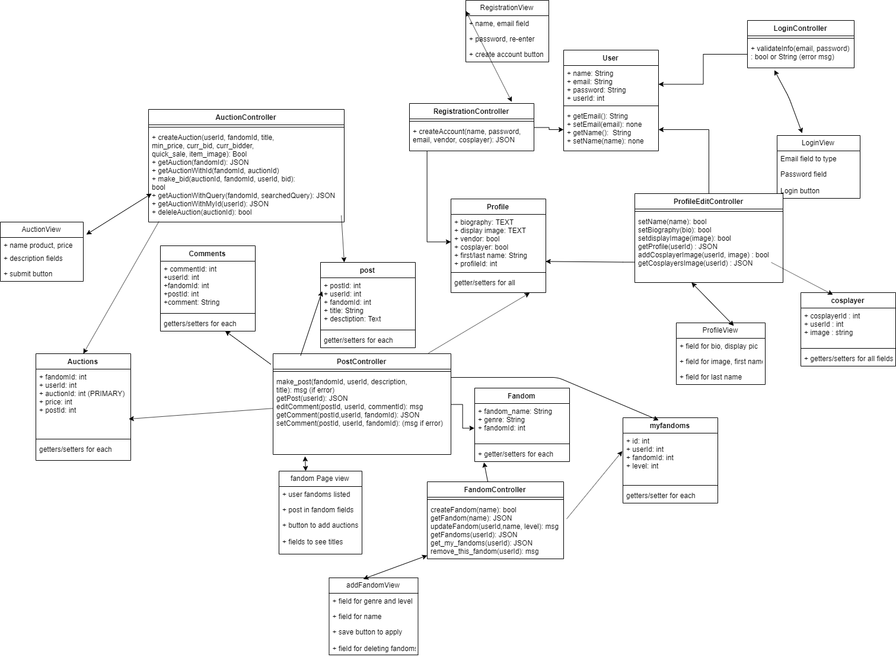

<h1 align="center">
System Design for Fanlinc
</h1>

## Project Development Team Members

* Muneeb Hashmi: hashmi27
* Afzal Patel: patelafz
* Didar Ibrahim: ibrah401
* Shaahid Sheth: shethsh1
* Alim Maredia: marediaa
* Weide Lu: luwei21
* Muhes Ariyaratnam: ariyar11

<h1 align="center">Table of Contents</h1>

[**CRC Cards**](#crc-cards)

1. [User](#user)
2. [Profile](#profile)
3. [Fandom](#fandom)
4. [Post](#post)
5. [myfandoms](#myfandoms)
6. [Auctions](#auctions)
7. [Cosplayer](#Cosplayer)
8. [RegistrationController](#registrationcontroller)
9. [RegistrationView](#registrationview)
10. [LoginController](#logincontroller)
11. [LoginView](#loginview)
12. [ProfileView](#profileview)
13. [ProfileEditController](#profileeditcontroller)
14. [FandomController](#fandomcontroller)
15. [AddFandomView](#addfandomview)
16. [PostController](#PostController)
17. [FandomPageView](#FandomPageView)
18. [AuctionView](#auctionview)
19. [AuctionController](#auctioncontroller)

[**System Architecture**](#system-architecture)

[System Architecture Diagram](#system-architecture-diagram)

[**Dependencies**](#Dependencies)

1. [Dependencies](#Dependencies)

[**Error-Handling Strategy**](#error-handling-strategy)

1. [error-handling-strategy](#error-handling-strategy)

<h1 align="center">CRC Cards</h1>

## User
**Parent Class:** N/A

**Interface:** N/A

**Responsibilities:**
* Knows its name
* Know its email
* Knows its password
* Has an identifier
* Can modify each category

**Collaborators:** N/A

[back to top](#table-of-contents)

## Profile
**Parent Class:** N/A

**Interface:** N/A

**Responsibilities:**
* Knows users biography
* Knows its display image
* Knows whether they are a vendor/cosplayer
* Knows users first name
* Knows users last name
* Has an identifier
* Can modify each category

**Collaborators:** N/A

[back to top](#table-of-contents)

## Fandom
**Parent Class:** N/A

**Interface:** N/A

**Responsibilities:**
* Knows its fandom names
* Knows who created each fandom
* Knows genre
* Has an identifier
* Can modify each category

**Collaborators:** N/A

[back to top](#table-of-contents)

## myfandoms
**Parent Class:** N/A

**Interface:** N/A

**Responsibilities:**
* Knows userId relationship to fandomId
* Knows level
* Has an identifier
* Can modify each category

**Collaborators:** N/A

[back to top](#table-of-contents)

## Post

**Parent Class:** N/A

**Interface:** N/A

**Responsibilities:**
* Knows relationship between a userId and a post 
* Knows all post and userId relating to it
* knows relationship with fandomId and userId
* knows the title of the post
* Has an identifier
* Ability to modify each category

**Collaborators:** N/A

[back to top](#table-of-contents)

## Auctions

**Parent Class:** N/A

**Interface:** N/A 

**Responsibilities:**
* Knows its fandomId that the auction is made
* Knows its userId of who made the auction
* Knows the price of the product
* Knows the name of the product
* Knows post id linked to auction
* Knows descriptions of the product
* Has an identifier
* Ability to modify each category

**Collaborators:** N/A

[back to top](#table-of-contents)

## Cosplayer

**Parent Class:** N/A

**Interface:** N/A 

**Responsibilities:**
* Knows its userId
* Knows its images connected to userId
* Knows Cosplayer id if they are
* Ability to modify each category

**Collaborators:** N/A

[back to top](#table-of-contents)

## RegistrationController

**Parent Class:** N/A

**Interface:** N/A

**Responsibilities:**
* Creates user accounts given name, password, email, and additional role info
* Validates user info (if email already exists)
* Shows an appropriate error/ success message to the view

**Collaborators:** 
* User
* Profile
* RegistrationView

[back to top](#table-of-contents)

## RegistrationView

**Parent Class:** N/A

**Interface:** N/A

**Responsibilities:**
* Has a name field
* Has an email field
* Has a password field
* Has a password and re-enter password field
* Clickable roles to choose (vendor / cosplayer)
* Has a create account button

**Collaborators:**
* RegistrationController

[back to top](#table-of-contents)

## LoginController

**Parent Class:** N/A

**Interface:** N/A

**Responsibilities:**
* Validates info given email and password
* Reports error messages if the information is wrong

**Collaborators:**
* User
* LoginView

[back to top](#table-of-contents)

## LoginView

**Parent Class:** N/A

**Interface:** N/A

**Responsibilities:**
* Has email field
* Has password field
* Has login button

**Collaborators:**
* LoginController

[back to top](#table-of-contents)

## ProfileView

**Parent Class:** N/A

**Interface:** N/A

**Responsibilities:**
* Has display picture in a text
* Has name in a text 
* Has email in a text
* Has biography a text
* Edit button on display picture, name, biography
* Edit button to change password

**Collaborators:**
* ProfileEditController

[back to top](#table-of-contents)

## ProfileEditController

**Parent Class:** N/A

**Interface:** N/A

**Responsibilities:**
* Ability to edit name given user id
* Ability to edit biography given user id
* Ability to edit display player given user id
* Updates new information to the database

**Collaborators:**
* Profile
* User
* Cosplayer
* ProfileView

[back to top](#table-of-contents)

## FandomController

**Parent Class:** N/A

**Interface:** N/A

**Responsibilities:**
* Allows user to create a new fandom given a userId
* Ability to retrieve all fandoms
* ability to create fandom given name
* ability to get the users fandom given userId
* ability to retrieve only fandoms you arent in given userId

**Collaborators:**
* Fandom
* myFandoms
* addFandomView

[back to top](#table-of-contents)

## AddFandomView

**Parent Class:** N/A

**Interface:** N/A

**Responsibilities:** 
* Has a genre field
* Has a level field
* Has a name field
* Add button

**Collaborators:**
* FandomController

[back to top](#table-of-contents)

## PostController

**Parent Class:** N/A

**Interface:** N/A

**Responsibilities:**
* Create a post given fandomId, userId, title, description
* Search within fandom page to find where certain posts are
* get post given user id
* get comment given user id and post id and fandomId
* set comment given user id and fandom id and post id

**Collaborators:**
* FandomPageView
* post
* Auctions
* Comments
* Fandom
* MyFandoms

[back to top](#table-of-contents)

## FandomPageView

**Parent Class:** N/A

**Interface:** N/A

**Responsibilities:**
* Displays all user fandoms
* Post field to write below in respective fandom
* Search field to search within fandoms since all fandoms are in 1 page scrollable
* add auction button

**Collaborators:**
* PostController

[back to top](#table-of-contents)

## AuctionView

**Parent Class:** N/A

**Interface:** N/A

**Responsibilities**:
* Field with name of product
* Field with price of product
* Submit button

**Collaborators:**
* AuctionController

[back to top](#table-of-contents)

## AuctionController

**Parent Class:** N/A

**Interface:** N/A

**Responsibilities:**
* Get bidding price of item given userId
* Ability to create an auction given userId, name, and price of product
* Get fandoms where the auctions are given userId

**Collaborators:**
* Post
* Auctions

[back to top](#table-of-contents)

<h1 align="center">System Architecture</h1>

## System Architecture Diagram

[back to top](#table-of-contents)

<h1 align="center">Dependencies</h1>

## Dependencies

For back end the dependencies are mysql and Flask and certain imports that can easily be installed through pip

    pip install -U Flask
    pip install pymysql
    pip install -U flask-cors
    pip install -U Flask-SQLAlchemy

For front end we are using node js with react. After install you would just use `npm install` on the front end folder. 

We will assume they have python 3 or above,pip, windows/linux/mac, and node js. Additionally we will assume they have internet. 

[back to top](#table-of-contents)

<h1 align="center">Error-Handling Strategy</h1>

## Error-Handling Strategy

Our error handling strategy for user input is that there will be an error messages sent to the view for invalid inputs. This is so we can tell the user what they are doing that is causing it and what input is needed. We will test many edge cases to ensure we get the correct input.  

In the case of network errors, if its on their part and their internet we will simply give them an error message and let them fix it on their own. If it's on our part, most we can do is give an warning message that the application is experiencing some network error.

In the case of system failures, this is impossible for us to find out so we will simply leave it to the user to reload the page. 

If the rest api will overload in our application we'll give an error message to the user. This is usually cause by the user spaming api request. For example if a user is creating an account and their internet is going slowly while spam clicking register. It would send several requests but it wouldn't cause an issue because emails/usernames are unique on the database. 

[back to top](#table-of-contents)
